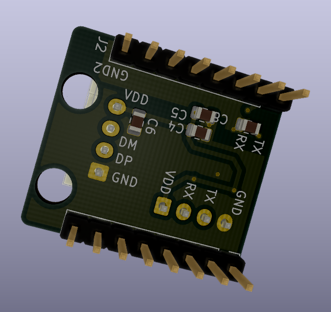

# Модуль для подключения к UART плат Robin Nano

Данный модуль предназначен для использования с платами MKS Robin Nano. Вставляется вместо MKS WIFI модуля и позволяет подключиться по UART. На модуле установлен изолятор ISO 7712 и USB-UART преобразователь FT230. На разъем J3 выведены сигналы USB, на разъем J4 выведены сигналы UART.

Проект сделан в KiCad.

## Схема платы

## Список компонентов

Список компонентов - [mks_wifi_bom.ods](./bom/mks_wifi_bom.ods)

| N  | Кол-во | Номинал | Размер | LCSC | Terra
| -----------| ---------- |---------|------- |----- |------- |
| C1, C2     | 2          | 47pF    | 0805   | <https://lcsc.com/product-detail/Multilayer-Ceramic-Capacitors-MLCC-SMD-SMT_YAGEO-CC0805JRNPO9BN470_C107118.html> | <https://spb.terraelectronica.ru/product/600072> |
| C3, C5     | 2          | 0.1uF   | 0805   | <https://lcsc.com/product-detail/Multilayer-Ceramic-Capacitors-MLCC-SMD-SMT_YAGEO-CC0805KRX7R9BB104_C49678.html> | <https://spb.terraelectronica.ru/product/251110> |
| C4         | 1          | 4.7uF   | 0805   | <https://lcsc.com/product-detail/Multilayer-Ceramic-Capacitors-MLCC-SMD-SMT_Murata-Electronics-GRM21BR61C475KA88L_C97915.html> | <https://spb.terraelectronica.ru/product/234492> |
| C6         | 1          | 0.01uF   | 0805   | <https://lcsc.com/product-detail/Multilayer-Ceramic-Capacitors-MLCC-SMD-SMT_YAGEO-CC0805KRX7R9BB103_C83170.html> | <https://spb.terraelectronica.ru/product/1350309> |
| C7, C8     | 2          | 1uF   | 0805   | <https://lcsc.com/product-detail/Multilayer-Ceramic-Capacitors-MLCC-SMD-SMT_Murata-Electronics-GCM21BR71H105KA03L_C126592.html> | <https://spb.terraelectronica.ru/product/884481> |
| J1, J2     | 2          | 1uF   | Conn_01x08 | <https://lcsc.com/product-detail/Pin-Header-Female-Header_Ckmtw-Shenzhen-Cankemeng-Headers-Pins-1-8P-2-54mm-Straight-line_C124381.html> | . |
| J3, J4     | 2          | JST XH2.54 |  .  |  . |
| R1, R2     | 2          | 27 Ом   | 0805   | <https://lcsc.com/product-detail/Chip-Resistor-Surface-Mount_UNI-ROYAL-Uniroyal-Elec-0805W8F270JT5E_C17594.html> | <https://spb.terraelectronica.ru/product/871706> |
| U1         | 1          | FT230XS | SSOP-16 3.9x4.9mm P0.635mm | <https://lcsc.com/product-detail/USB-ICs_FTDI-FT230XS-R_C69082.html> | <https://spb.terraelectronica.ru/product/1339655> |
| U2         | 1          | ISO7721 | SOIC-8 3.9x4.9mm P1.27mm | <https://lcsc.com/product-detail/Digital-Isolators_Texas-Instruments-Texas-Instruments-ISO7721DR_C366164.html> | <https://spb.terraelectronica.ru/product/2301597> |
